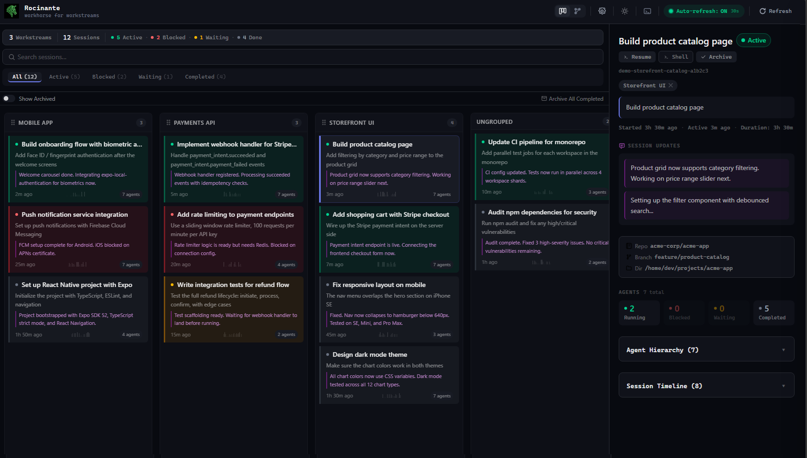

# Rocinante

[](https://github.com/gaburn/rocinante/actions/workflows/ci.yml)

*workhorse for workstreams*

A real-time dashboard for organizing agentic coding sessions into workstreams and interacting with them. When you have dozens of Claude/Copilot CLI sessions running across multiple projects, Rocinante gives you a kanban board to track them all, see what each session is working on, and jump into any session with a single click.

Named after the ship from *The Expanse*, which was named after Don Quixote's horse.



---

## Features

### Kanban Board
- **Workstream columns**: Sessions grouped by workstream in a horizontal kanban board, one column per workstream plus an "Ungrouped" column for unassigned sessions
- **+ New Workstream**: Create named workstreams from a "+ Workstream" button above the board — optionally set a repo path
- **In-column session launch**: Each workstream column has a "+" button to launch a new agent session directly into that workstream. Auto-detects available agent types (Copilot CLI, Claude CLI, or shell) and launches with one click
- **Workstream favorites**: Click the ★ star on a column to favorite it — favorited workstreams sort to the front of the board
- **Workstream archive**: Archive workstreams (and all their sessions) when done — archived workstreams are hidden from the kanban view
- **Drag-and-drop sessions**: Reassign sessions between workstreams by dragging tiles between columns (@dnd-kit)
- **Column reorder**: Drag workstream columns by their grip handle to rearrange, order persisted to localStorage
- **Status-coded tiles**: Emerald (active), red (blocked), amber (waiting), gray (completed). Active and blocked sessions float to the top
- **Latest context on tiles**: Each tile shows the most recent user message and a magenta assistant-update bubble with Claude/Copilot's latest status
- **Auto-select new sessions**: Launching a session via "+" auto-selects it so you immediately see its details
- **Workstream count**: Status summary bar includes workstream count

### Session Detail
- **Session Updates**: Fuchsia-accented scrollable list of assistant status messages with preserved line breaks
- **Agent Hierarchy**: Collapsible tree (collapsed by default) with unified arrow icons
- **Squad Cast List**: Team members extracted from session events, displayed with roles and emoji
- **Source badge**: Teal (Copilot) or amber (Claude) indicator of the session source
- **Git context**, Session Timeline, tool results, performance waterfall

### Other Views
- **Neural Network View**: Animated force-directed graph visualization of all sessions and agents (d3-force + Canvas)
- **Embedded Terminal**: Session-scoped terminals that auto-resume Claude/Copilot sessions in their working directory (xterm.js + node-pty)
- **Settings**: 20+ configurable options with localStorage persistence + server config API. Includes configurable launch commands for each agent type (persisted to `~/.rocinante/launch-commands.json`). About section shows version and GitHub repo link
- **Light/Dark Mode**: Full theme support with system preference detection
- **Real-time Updates**: Auto-refresh with configurable interval

## User Guide

For a comprehensive guide on using the dashboard, see **[docs/user-guide.md](./docs/user-guide.md)**. It covers the kanban board, search, auto-grouping, session details, settings, demo mode, and more.

## Recent Changes

### v1.5.0 (Latest)

**Workstream Management**
- **+ New Workstream** button to create named workstreams with optional repo path
- **In-column session launch** — "+" button per column launches a new agent session directly into that workstream, auto-detecting available CLIs
- **Agent type detection** — backend detects which CLI agents are on your PATH (`copilot`, `claude`) and shows only available options
- **Workstream favorites** — star a column to pin it to the front of the board
- **Workstream archive** — archive a workstream to hide it; cascade archive removes all its sessions too
- **Auto-select new sessions** — newly launched sessions are immediately selected in the detail pane

**Launch Commands**
- Configurable CLI launch commands per agent type via Settings (e.g., `agency copilot --yolo`)
- Persisted to `~/.rocinante/launch-commands.json`

**Security Hardening**
- All 12 pre-existing CodeQL alerts resolved
- Path injection fixes (`path.resolve()` + `startsWith()` sanitizer pattern)
- Rate limiting with `express-rate-limit` on all route handlers
- Tainted format string fixes (user data as separate `console.warn` args)
- Type confusion fixes (explicit `typeof` checks on Express query params)
- CI workflow permissions tightened (`contents: read`)

### v1.4.0

**Performance**
- Body-parser limit increased to 2 MB (fixes `PayloadTooLargeError` on archive sync with large session stores)
- Multi-source provider now wires `excludeIds` + computation cache (was completely bypassed on `auto` config — the default)
- Claude session source pre-filter bug fixed
- `AbortController` on session polling (prevents stale request pileup on slow connections)
- Vite `optimizeDeps.include` added (dev startup 9 s → 6.1 s)
- `GET /api/sessions` benchmark: avg 2.23 ms (was ~60 s for large session stores)

**Features**
- Universal plan reader: supports checkboxes (`- [x]`/`- [ ]`), numbered lists, markdown tables, nested bullets, code blocks, `#` headings
- Hybrid plan completion model (file-sourced checkboxes + localStorage toggles)
- Session Plan loads correctly on initial session selection (fixed race condition)

**UI / Dark Mode**
- Brightened repo/branch/folder icons for dark-mode visibility
- Brightened section headers (Latest Prompt, Cast, Session Updates, Agents)
- Squad badge logo opacity adjusted for dark mode

**Quality**
- 233 tests passing (was ~195)
- 38 lint errors fixed (`no-explicit-any` + `no-unused-vars`)
- TypeScript clean (server + client)

### v1.3.0
- **Claude Code CLI support**: Rocinante now detects and displays sessions from Claude Code CLI alongside Copilot sessions. Sessions from `~/.claude/projects/` are auto-detected and shown with amber Claude badges. No configuration needed — just works if both CLIs are installed.
- **Multi-source auto-detection**: Default behavior checks which data directories exist and shows all available sources (Copilot, Claude, or both). Can be overridden in Settings or via the `SESSION_SOURCES` environment variable.
- **Source badges & filter**: Teal "Copilot" and amber "Claude" badges appear on session tiles, cards, and detail view. Header includes a source filter dropdown (All / Copilot / Claude).
- **Squad session detection**: Sessions using Squad show a Squad logo badge on tiles with a tooltip. The detail view displays a cast list showing team members with their roles and emoji.
- **Settings panel enhancements**: New session sources selector ("Auto-detect" / "Copilot" / "Claude" / "Both") and Claude directory path configuration option.
- **"Built with Squad" attribution**: About section now credits Squad as a dependency.

### v1.2.1
- **Waiting for Input indicator**: Sessions using `ask_user` show a `?` icon on tiles with an amber glow. The detail pane displays the question text and available choices.
- **Session ID search**: The search bar now supports partial session ID matching for faster session lookup.
- **Inline markdown rendering**: Session updates properly render bold, italic, code, and table formatting.
- **Session updates fix**: Coordinator text now displays correctly (previously showed sub-agent results).
- **Cleaner tiles**: Removed sparklines from session tiles for a streamlined UI.
- **Improved sparkline bucketing**: Activity buckets now calculate based on event time range rather than the full session span for more accurate activity visualization.

---

*(placeholder: the main view is a horizontal kanban board with color-coded session tiles organized by workstream, and a resizable detail sidebar on the right)*

---

## Prerequisites

- Node.js 22+
- C++ build tools (required by `node-pty` native module):
  - **Windows**: Visual Studio Build Tools with **Desktop development with C++**
  - **macOS**: Xcode Command Line Tools (`xcode-select --install`)
  - **Linux**: `build-essential` (and standard compiler toolchain)
- At least one of the following installed and configured:
  - GitHub Copilot CLI (`~/.copilot/` directory with session data)
  - Claude Code CLI (`~/.claude/projects/` directory with session data)
  - Both CLIs for full multi-source experience

---

## Quick Start

```bash
# Clone the repo
git clone https://github.com/gaburn/rocinante.git
cd rocinante

# Install dependencies (includes native module compilation)
npm install

# Start development server (frontend + backend)
npm run dev

# Open in browser
# http://localhost:5173
```

---

## Supported Session Sources

Rocinante supports sessions from multiple sources:

- **Copilot**: GitHub Copilot CLI sessions (`~/.copilot/session-state/` and `~/.copilot/session-store.db`)
- **Claude**: Claude Code CLI sessions (`~/.claude/projects/`)
- **Auto-detect** (default): Automatically detects which sources are available based on directory existence

Configure session sources via:
1. **Settings panel** → "Session Sources" selector
2. **Environment variable**: `SESSION_SOURCES=auto|copilot|claude|both`
3. **Claude directory** (if using Claude): Configurable in Settings → "Claude Directory"

---

## Environment Variables

Create a `.env` file from `.env.example` as needed.

| Variable | Default | Description |
|---|---|---|
| `API_PORT` | `3001` | Backend API/WS port used by Express and terminal WebSocket server |
| `SESSION_SOURCES` | `auto` | Session sources to load: `auto` (detect available), `copilot`, `claude`, or `both` |
| `SESSION_STATE_DIR` | `~/.copilot/session-state` | Directory containing per-session state folders and `events.jsonl` files |
| `SQLITE_DB_PATH` | `~/.copilot/session-store.db` | Path to Copilot SQLite session metadata database |
| `CLAUDE_PROJECTS_DIR` | `~/.claude/projects` | Directory containing Claude Code CLI project sessions |
| `TAIL_BYTES` | `524288` | Number of bytes read from end of each `events.jsonl` file |
| `STALE_THRESHOLD_MS` | `300000` | Inactivity threshold before a session is considered stale/completed |
| `CACHE_TTL_MS` | `10000` | In-memory cache TTL for event tail reads |
| `MAX_TIMELINE_EVENTS` | `100` | Maximum timeline events returned to the UI |
| `ALLOWED_ORIGINS` | `http://localhost:5173,http://localhost:3001` | Comma-separated CORS origins in `.env.example` (currently not enforced by server code) |

---

## Architecture

```text
Frontend (Vite + React + TypeScript + Tailwind CSS v4)
├── Kanban View: horizontal board (workstream columns + resizable detail sidebar)
├── Network View: animated force-directed graph (d3-force + Canvas)
├── Terminal: session-scoped xterm.js terminals
└── Settings: configurable preferences

Backend (Express + TypeScript)
├── /api/sessions: session data from SQLite + events.jsonl
├── /api/config: runtime configuration
└── /ws/terminal: WebSocket PTY bridge (node-pty)

Data Sources
├── Copilot
│   ├── ~/.copilot/session-store.db: SQLite (session metadata)
│   ├── ~/.copilot/session-state/{id}/events.jsonl: event logs
│   └── ~/.copilot/session-state/{id}/workspace.yaml: session config
├── Claude
│   └── ~/.claude/projects/: Project directories with session metadata and event logs
└── Config
    └── ~/.rocinante/launch-commands.json: custom CLI launch commands per agent type
```

### Runtime Flow (high-level)

1. Backend reads session metadata from SQLite and event tails from `events.jsonl`.
2. Backend maps raw data into normalized session objects (status, tree, timeline, activity buckets).
3. Frontend polls `/api/sessions` on a configurable interval and renders list/detail/network views.
4. Terminal panel opens WebSocket connections to `/ws/terminal` and binds PTY output to xterm.js.

---

## Available Scripts

| Script | Description |
|---|---|
| `npm run dev` | Start both frontend (Vite) and backend (Express via tsx watch) |
| `npm run dev:client` | Start frontend only |
| `npm run dev:server` | Start backend only |
| `npm run build` | TypeScript compile + Vite production build |
| `npm run preview` | Preview production build |
| `npm run lint` | Run ESLint |

---

## API Reference

### `GET /api/sessions`
Returns all sessions.

- **200**: `Session[]`
- **500**: `{ "error": "..." }`

### `GET /api/sessions/:id`
Returns one session by ID.

- **200**: `Session`
- **404**: `{ "error": "Session not found" }`
- **500**: `{ "error": "..." }`

### `GET /api/config`
Returns runtime configuration exposed to UI settings.

- **200**:
  ```json
  {
    "sessionStateDir": "...",
    "tailBytes": 524288,
    "staleThresholdMs": 300000,
    "maxTimelineEvents": 100
  }
  ```

### `PATCH /api/config`
Updates runtime configuration fields.

- **Body**: Partial of `sessionStateDir`, `tailBytes`, `staleThresholdMs`, `maxTimelineEvents`
- **200**: Updated config object
- **400**: Validation errors (`unknown field`, invalid enum values, invalid directory path)
- **500**: `{ "error": "..." }`

### `WS /ws/terminal?sessionId=X&cwd=Y&shell=Z`
Terminal bridge over WebSocket.

- If `sessionId` is provided, backend starts terminal with `copilot --resume=<sessionId>`.
- One terminal connection per `sessionId` is allowed.
- **Client messages**:
  - `{ "type": "input", "data": "..." }`
  - `{ "type": "resize", "cols": 120, "rows": 30 }`
- **Server messages**:
  - raw terminal output stream
  - `{ "type": "exit", "code": 0 }`
  - `{ "type": "error", "message": "..." }`

---

## Keyboard Shortcuts

| Shortcut | Action |
|---|---|
| `Ctrl+\`` | Toggle terminal panel |
| `Esc` | Close settings/detail/confirm overlays (when focused/open) |

---

## Troubleshooting

- **EADDRINUSE on port 3001**  
  Kill stale processes: `taskkill /F /IM node.exe`  
  (or find PID with `netstat -ano | findstr :3001`)

- **`node-pty` build failure**  
  Install required C++ build tools for your platform (see Prerequisites), then reinstall dependencies.

- **"Terminal disconnected"**  
  Ensure backend server is running (`npm run dev:server`) and check backend logs for PTY spawn errors.

- **Empty session list**  
  Verify Copilot session data exists under `~/.copilot/`, and confirm `SESSION_STATE_DIR` / `SQLITE_DB_PATH` are correct.

- **Config update fails with 400**  
  Use only supported values:
  - `tailBytes`: `262144`, `524288`, `1048576`, `2097152`
  - `staleThresholdMs`: `60000`, `300000`, `900000`, `1800000`
  - `maxTimelineEvents`: `50`, `100`, `200`, `500`

---

## Tech Stack

- **Frontend**: React 19, Vite 8, TypeScript, Tailwind CSS v4, @dnd-kit (drag-and-drop), d3-force, xterm.js
- **Backend**: Express 5, better-sqlite3, express-rate-limit, node-pty, ws, tsx

---

## License

MIT. See [LICENSE](./LICENSE).
